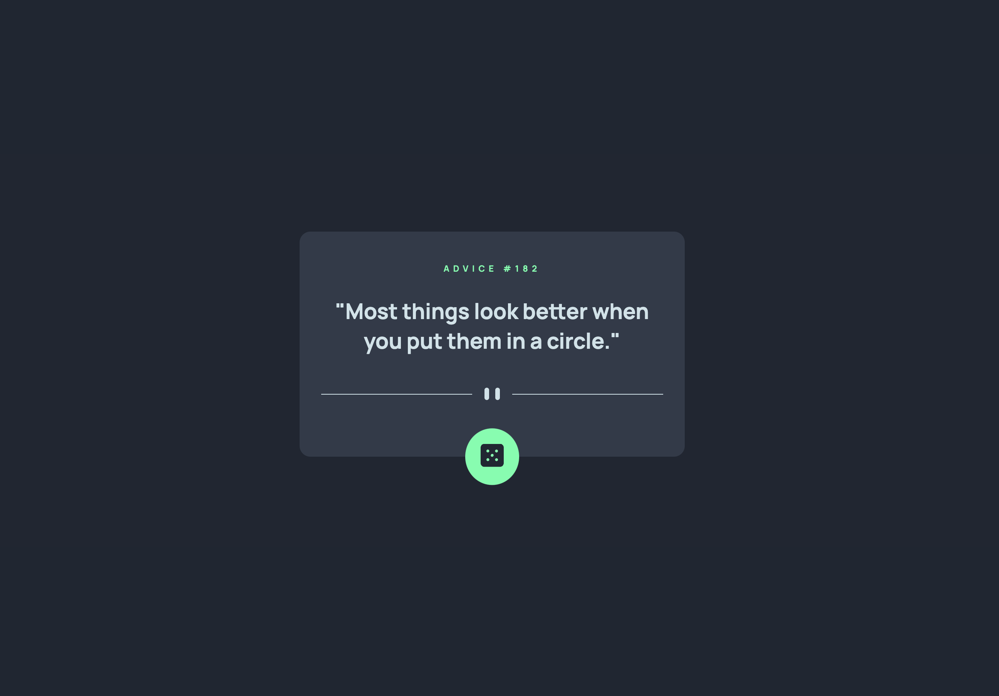
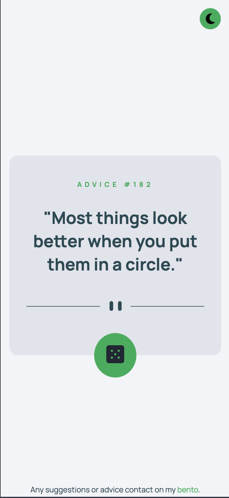

# Advice generator app

 Advice generator app using the [Advice Slip API](https://api.adviceslip.com/#top)

 

## Features

- Switch theme mode
- Generate a new piece of advice by clicking the dice icon

### Usage

- View the optimal layout for the app depending on their device's screen size
- See hover states for all interactive elements on the page
- Generate a new piece of advice by clicking the dice icon
- switch  theme mode

## Preview

 k

## Development

### Technologies Used

**Client:** JavaScript, CSS, HTML
**Server:** Advice Slip API

### Built with

- Semantic HTML5 markup
- CSS custom properties
- Mobile-first workflow

## Future Plans

*A roadmap or future plans for features and improvements to the application.*

## Social Links

## Demo

You can try out the TodoList App demo here: 

